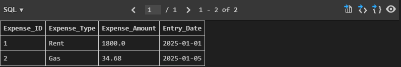

# Personal Budget Tracker

A command-line Python application for tracking income, expenses, and totals using SQLite for data persistence.

## Features

- Add, view, and edit income and expense entries  
- Date validation, including future date confirmation  
- User-friendly CLI menus with clear formatting  
- Persistent storage with SQLite database  
- Handles empty data tables gracefully  

## Current Status

This project is currently implemented as a single Python script. While it is mostly functional and covers core features, there are some known limitations:

- Input validation can be improved  
- Sorting and pagination of entries is not yet implemented  
- Search functionality is planned but not yet available  
- Refactoring into multiple modules and better code organization is planned for future updates

## Planned Improvements
- Modularize code into multiple files for better maintainability
- Add more advanced input validation and error handling
- Implement sorting, pagination, and search features
- Improve CLI user experience and navigation flow

## Requirements

- Python 3.12 or higher  
- No external libraries required (uses built-in `sqlite3` module)

## Getting Started

**Clone with Git (recommended install method):**
```bash
git clone https://github.com/Zacarette/Budget-Tracker.git
cd Budget-Tracker
python "SQLite Data Persistence.py"
```

## Screenshots

### Main Menu  

Main Menu of Budget Tracker  
  
  

### Log and View Expense  

Expense Log  
  
  
  
Expense Display  
  
  

### Edit Datase (Example shown with income)  
  
Edit Income  
  
  
  
### View Totals  
  
Totals and Balance Display  
  
  
  
### SQLite Database Persistence  
  
Expense Database  
  

  
Income Database  
  
  
  
Totals and Balance Database  
  
  

## Author
Michael Zaccaria
[https://github.com/Zacarette]

## License
No license yet.
